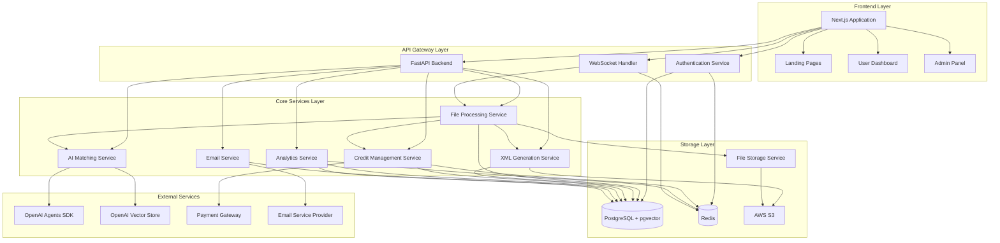

# Components

## Frontend Components

**Responsibility:** Next.js application handling public landing pages, user dashboard, and admin panel with unified design system

**Key Interfaces:**
- HTTP REST API client for backend communication
- WebSocket client for real-time processing updates
- NextAuth.js integration for authentication state
- React Query for server state management
- Zustand for client-side state management

**Dependencies:** FastAPI backend, authentication service, file upload service

**Technology Stack:** Next.js 15 with App Router, TypeScript, Tailwind CSS, shadcn/ui components, React Query, Zustand

## Authentication Service

**Responsibility:** User authentication, authorization, session management, and role-based access control across all application areas

**Key Interfaces:**
- JWT token generation and validation API
- NextAuth.js provider integration
- Role-based middleware for route protection
- Session storage and retrieval from Redis
- Password hashing and validation

**Dependencies:** PostgreSQL user database, Redis session store, email service

**Technology Stack:** NextAuth.js (frontend), FastAPI JWT middleware (backend), bcrypt for password hashing, Redis for session storage

## File Processing Service

**Responsibility:** Orchestrates the complete file processing workflow from CSV/XLSX upload through AI processing to XML generation

**Key Interfaces:**
- File upload API with validation
- AI processing orchestration
- Progress tracking and WebSocket notifications
- XML generation and storage
- Credit consumption tracking

**Dependencies:** AI matching service, file storage service, XML generation service, database

**Technology Stack:** FastAPI with async processing, Pandas for data parsing, Pydantic for validation, background tasks with Redis queues

## AI Matching Service

**Responsibility:** HS code matching using OpenAI Agents SDK with FileSearchTool for Vector Store queries

**Key Interfaces:**
- Product description to HS code matching API via OpenAI Agents SDK
- AI-powered semantic search using FileSearchTool
- Confidence scoring and alternative suggestions
- Batch processing for multiple products
- Performance monitoring and logging

**Dependencies:** OpenAI Agents SDK, OpenAI Vector Store (external), FileSearchTool

**Technology Stack:** OpenAI Agents SDK, FileSearchTool with vector_store_ids configuration, Python async processing

## XML Generation Service

**Responsibility:** Converts AI-processed data into country-specific declaration.xsd-compliant XML files

**Key Interfaces:**
- Country schema selection API
- XSD validation and XML generation
- Template management for different countries
- Validation error reporting
- Generated file storage integration

**Dependencies:** File storage service, country schema configuration, XSD validation libraries

**Technology Stack:** xsdata for XSD parsing and XML generation, Jinja2 for XML templating, country-specific schema files

## Component Diagrams

