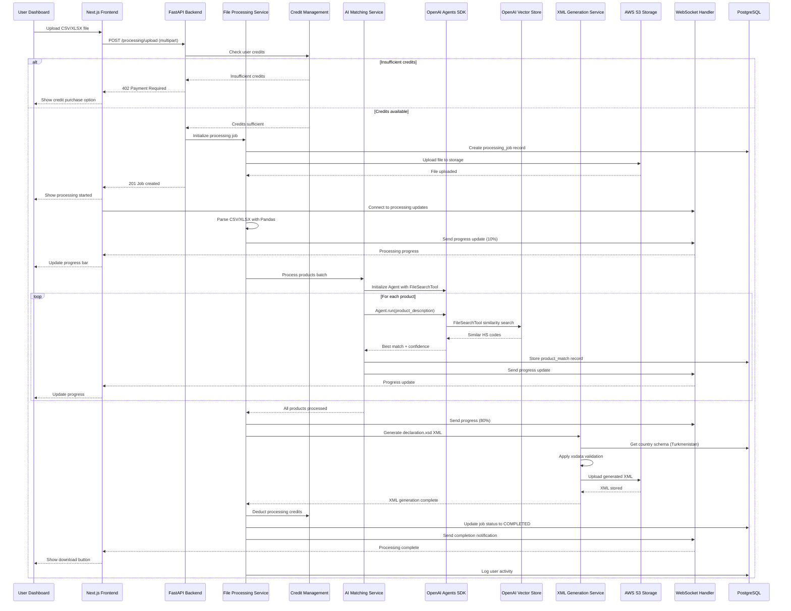
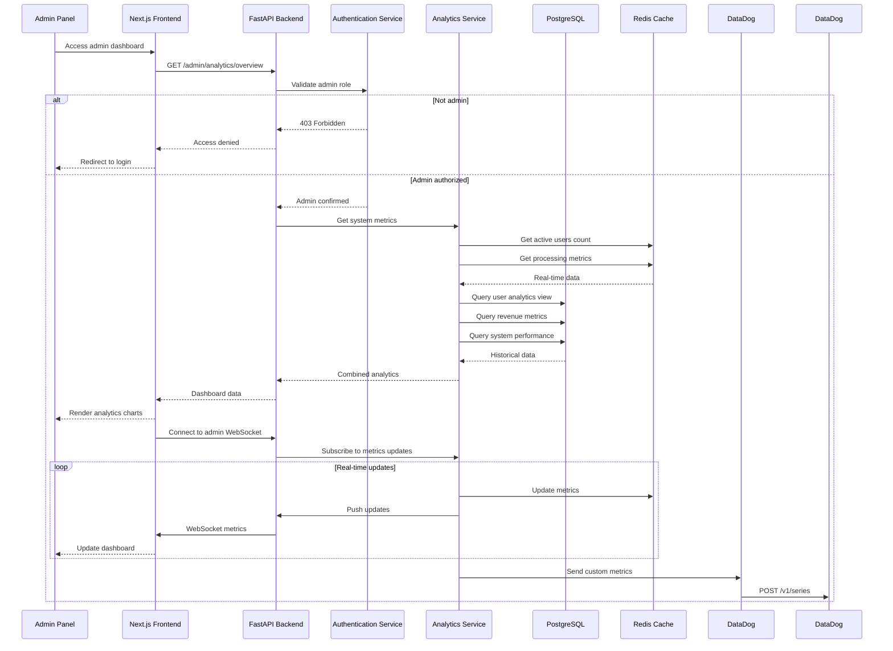

# Core Workflows

## File Processing Workflow (Complete AI Pipeline)

```mermaid
sequenceDiagram
    participant User as User Dashboard
    participant NextJS as Next.js Frontend
    participant FastAPI as FastAPI Backend
    participant FileProc as File Processing Service
    participant Credits as Credit Management
    participant AI as AI Matching Service
    participant OpenAI as OpenAI Agents SDK
    participant VectorStore as OpenAI Vector Store
    participant XML as XML Generation Service
    participant S3 as AWS S3 Storage
    participant WS as WebSocket Handler
    participant DB as PostgreSQL

    User->>NextJS: Upload CSV/XLSX file
    NextJS->>FastAPI: POST /processing/upload (multipart)
    FastAPI->>Credits: Check user credits
    
    alt Insufficient credits
        Credits-->>FastAPI: Insufficient credits
        FastAPI-->>NextJS: 402 Payment Required
        NextJS-->>User: Show credit purchase option
    else Credits available
        Credits-->>FastAPI: Credits sufficient
        FastAPI->>FileProc: Initialize processing job
        FileProc->>DB: Create processing_job record
        FileProc->>S3: Upload file to storage
        S3-->>FileProc: File uploaded
        FastAPI-->>NextJS: 201 Job created
        NextJS-->>User: Show processing started
        
        %% Real-time WebSocket connection
        NextJS->>WS: Connect to processing updates
        
        %% Background async processing
        FileProc->>FileProc: Parse CSV/XLSX with Pandas
        FileProc->>WS: Send progress update (10%)
        WS-->>NextJS: Processing progress
        NextJS-->>User: Update progress bar
        
        FileProc->>AI: Process products batch
        AI->>OpenAI: Initialize Agent with FileSearchTool
        
        loop For each product
            AI->>OpenAI: Agent.run(product_description)
            OpenAI->>VectorStore: FileSearchTool similarity search
            VectorStore-->>OpenAI: Similar HS codes
            OpenAI-->>AI: Best match + confidence
            AI->>DB: Store product_match record
            AI->>WS: Send progress update
            WS-->>NextJS: Progress update
            NextJS-->>User: Update progress
        end
        
        AI-->>FileProc: All products processed
        FileProc->>WS: Send progress (80%)
        
        FileProc->>XML: Generate declaration.xsd XML
        XML->>DB: Get country schema (Turkmenistan)
        XML->>XML: Apply xsdata validation
        XML->>S3: Upload generated XML
        S3-->>XML: XML stored
        XML-->>FileProc: XML generation complete
        
        FileProc->>Credits: Deduct processing credits
        FileProc->>DB: Update job status to COMPLETED
        FileProc->>WS: Send completion notification
        WS-->>NextJS: Processing complete
        NextJS-->>User: Show download button
        
        %% Analytics tracking
        FileProc->>DB: Log user activity
    end
```

## Admin Analytics Dashboard Workflow

```mermaid
sequenceDiagram
    participant Admin as Admin Panel
    participant NextJS as Next.js Frontend
    participant FastAPI as FastAPI Backend
    participant Auth as Authentication Service
    participant Analytics as Analytics Service
    participant DB as PostgreSQL
    participant Cache as Redis Cache
    participant Monitoring as DataDog

    Admin->>NextJS: Access admin dashboard
    NextJS->>FastAPI: GET /admin/analytics/overview
    FastAPI->>Auth: Validate admin role
    
    alt Not admin
        Auth-->>FastAPI: 403 Forbidden
        FastAPI-->>NextJS: Access denied
        NextJS-->>Admin: Redirect to login
    else Admin authorized
        Auth-->>FastAPI: Admin confirmed
        FastAPI->>Analytics: Get system metrics
        
        %% Real-time metrics from cache
        Analytics->>Cache: Get active users count
        Analytics->>Cache: Get processing metrics
        Cache-->>Analytics: Real-time data
        
        %% Historical data from database
        Analytics->>DB: Query user analytics view
        Analytics->>DB: Query revenue metrics
        Analytics->>DB: Query system performance
        DB-->>Analytics: Historical data
        
        Analytics-->>FastAPI: Combined analytics
        FastAPI-->>NextJS: Dashboard data
        NextJS-->>Admin: Render analytics charts
        
        %% Real-time WebSocket updates
        NextJS->>FastAPI: Connect to admin WebSocket
        FastAPI->>Analytics: Subscribe to metrics updates
        
        loop Real-time updates
            Analytics->>Cache: Update metrics
            Analytics->>FastAPI: Push updates
            FastAPI->>NextJS: WebSocket metrics
            NextJS-->>Admin: Update dashboard
        end
        
        %% External monitoring
        Analytics->>Monitoring: Send custom metrics
        Monitoring->>DataDog: POST /v1/series
    end
```
