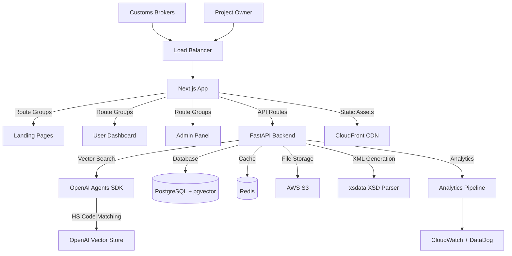

# High Level Architecture

## Technical Summary

XM-Port is built as a modern monolithic full-stack application using Next.js 15 with App Router for the frontend and FastAPI for the backend. The architecture centers around AI-powered HS code matching using the OpenAI Agents SDK, supporting a complete workflow from CSV/XLSX upload through AI processing to ASYCUDA-compliant XML generation. The monolithic approach enables seamless integration between the public landing page, authenticated user dashboard, and admin analytics panel while maintaining excellent developer experience through shared TypeScript types and component libraries. The system is deployed on cloud infrastructure with PostgreSQL for transactional data, Redis for caching and real-time features, and leverages modern patterns like static site generation for marketing content and real-time WebSocket updates for processing feedback.

## Platform and Infrastructure Choice

**Platform:** AWS Full Stack (recommended)

**Key Services:** 
- **Frontend**: Vercel (Next.js hosting with edge functions)
- **Backend**: AWS ECS Fargate (containerized FastAPI)
- **Database**: AWS RDS PostgreSQL with pgvector extension
- **Cache**: AWS ElastiCache Redis
- **Storage**: AWS S3 for file storage
- **CDN**: AWS CloudFront
- **Monitoring**: AWS CloudWatch + DataDog

**Deployment Host and Regions:** 
- Primary: AWS us-east-1 (N. Virginia)
- CDN: Global edge locations via CloudFront
- Future expansion: eu-west-1 for European customers

## Repository Structure

**Structure:** Monorepo with shared packages
**Monorepo Tool:** npm workspaces (simple, no additional tooling needed)
**Package Organization:** 
- Single Next.js app handling landing page, dashboard, and admin panel
- Shared TypeScript types between frontend and backend
- Reusable UI components across all sections
- Centralized configuration and utilities

## High Level Architecture Diagram

## Architectural Patterns

- **Jamstack Architecture:** Static landing pages with serverless API routes - _Rationale:_ Optimal SEO and performance for marketing content while maintaining dynamic functionality
- **Component-Based UI:** Reusable React components with TypeScript - _Rationale:_ Maintainability and consistency across landing page, dashboard, and admin panel
- **Repository Pattern:** Abstract data access logic - _Rationale:_ Enables testing and future database migration flexibility
- **API Gateway Pattern:** Single FastAPI entry point with route organization - _Rationale:_ Centralized auth, rate limiting, and monitoring
- **Agent-Based AI Pattern:** OpenAI Agents SDK for AI orchestration - _Rationale:_ Production-ready AI processing with built-in error handling and retry mechanisms
- **Credit-Based Metering Pattern:** Token-based usage tracking - _Rationale:_ Flexible billing model supporting freemium and paid tiers
